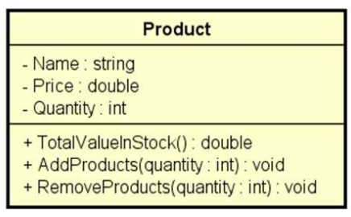

# Problema "estoque"

Fazer um programa para ler os dados de um produto em estoque (nome, preço e quantidade no estoque).

Em seguida:

- Mostrar os dados do produto (nome, preço, quantidade no estoque, valor total no estoque)
- Realizar uma entrada no estoque e mostrar novamente os dados do produto
- Realizar uma saída no estoque e mostrar novamente os dados do produto

Para resolver este problema, você deve criar uma **CLASSE** conforme o projeto abaixo:

## Exemplo de entrada e saída

### Entrada

| Entrada                    | Exemplo 1 |
| :------------------------- | :-------- |
| **Nome do produto:**       | TV        |
| **Preço:**                 | 900.00    |
| **Quantidade em estoque:** | 10        |
| **Entrada no estoque:**    | 5         |
| **Saída do estoque:**      | 3         |

### Saída

| Saída                        | Exemplo 1                                 |
| :--------------------------- | :---------------------------------------- |
| **Dados do produto:**        | TV, $ 900.00, 10 units, Total: $ 9000.00  |
| **Após entrada no estoque:** | TV, $ 900.00, 15 units, Total: $ 13500.00 |
| **Após saída do estoque:**   | TV, $ 900.00, 12 units, Total: $ 10800.00 |
