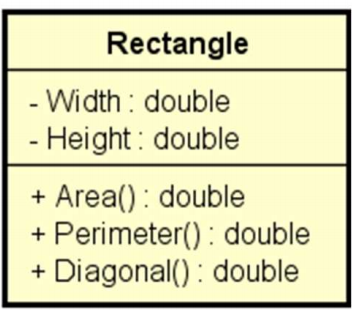

# Problema "retangulo"

Fazer um programa para ler os valores da largura e altura de um retângulo. Em seguida, mostrar na tela o valor de sua área, perímetro e diagonal. Usar uma classe como mostrado no projeto abaixo.

## Diagrama UML da Classe

| Rectangle                                                                |
| :----------------------------------------------------------------------- |
| - Width : double   - Height : double                                  |
| + Area() : double   + Perimeter() : double   + Diagonal() : double |

---

## Exemplo de entrada e saída

### Entrada

| Entrada                  | Exemplo 1 | Exemplo 2 |
| :----------------------- | :-------- | :-------- |
| **Base do retângulo:**   | 4.0       | 10.3      |
| **Altura do retângulo:** | 5.0       | 13.1      |

### Saída

| Saída           | Exemplo 1 | Exemplo 2 |
| :-------------- | :-------- | :-------- |
| **ÁREA =**      | 20.0000   | 134.9300  |
| **PERÍMETRO =** | 18.0000   | 46.8000   |
| **DIAGONAL =**  | 6.4031    | 16.6643   |
